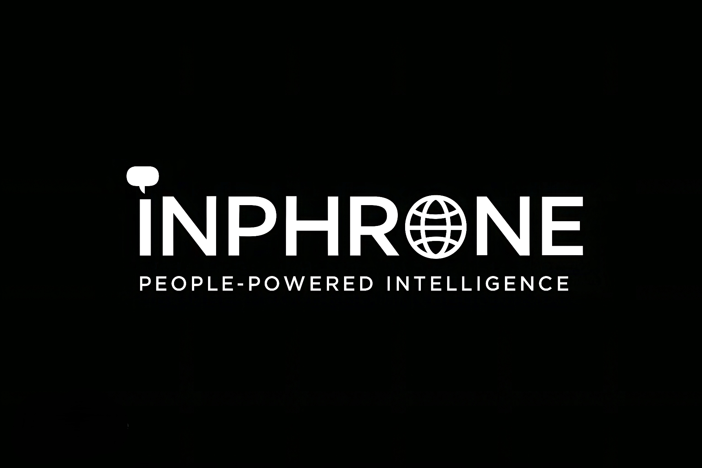

# Inphrone™ - People-Powered Entertainment Intelligence Platform

<div align="center">
  
  
  **World's First People-Powered Entertainment Intelligence Platform**
  
  *Where Audience Emotion Meets Creative Vision*

  [](https://inphrone.com)
  [](https://www.linkedin.com/company/inphrone)
  [](https://x.com/inphrone)
  [](https://instagram.com/inphrone)
</div>

---

## 👨‍💻 Founder

**Thangella Gadidamalla** (G. Thangella)  
*Product Thinker • System Designer • Founder*

Building products at the intersection of human behavior, technology, and design — with a deep focus on clarity, purpose, and long-term impact.

- 🔗 [LinkedIn](https://www.linkedin.com/in/gthangella/)
- 🐦 [Twitter](https://twitter.com/g_thangella)
- 📧 [thangella@inphrone.com](mailto:thangella@inphrone.com)

---

## 📱 What is Inphrone?

**Inphrone** is a revolutionary entertainment insights platform that bridges the gap between audiences and content creators across Film, Music, TV/OTT, Gaming, YouTube, Social Media, and App Development.

The name combines:
- **IN** = Insights
- **PHRONE** = Phronesis (practical wisdom in Greek)

Together, **Inphrone** represents human-driven intelligence guided by real-world behavior, not assumptions.

### 🎯 Core Mission

Democratize entertainment intelligence by giving audiences a voice while providing creators, studios, and platforms with authentic, actionable insights.

---

## ✨ Core Features

### 1. 📊 InphroSync - Daily Entertainment Pulse
Our flagship feature that drives daily engagement:
- **3 Daily Questions** about yesterday's entertainment consumption
- **Interactive Swipeable Cards** - Tinder-style interface for engaging interaction
- **Real-time Community Insights** with live stats and demographic filters
- **Streak Tracking** - Build daily habits and earn rewards
- **Gamified Experience** - Confetti celebrations, progress indicators, visual feedback
- **Demographic Filtering** - View results by age, gender, and location

### 2. 🔥 Hype It - Demand Signaling System
Tell studios what YOU want created:
- **Submit 2-3 word signals** describing content you want to see
- **Vote 🔥 Hype or ➡️ Pass** on community signals
- **7-day lifecycle** for signals
- **Signal Score** = Hype count - Pass count
- **Real-time analytics** and trending signals
- **Top signals inform real content decisions**

### 3. 🎯 Your Turn - Slot Competitions
Community-driven question battles:
- **3 Daily Slots**: 9 AM, 2 PM, 7 PM IST
- **Submit questions** and let the community vote
- **Winners get featured** and earn recognition
- **Real-time voting** with live results

### 4. 💬 Opinion Sharing & Insights
- Submit detailed opinions across **8 entertainment categories**
- Rich opinion data: title, genre, budget estimates, target audience
- Upvoting system for non-audience users
- View tracking and analytics
- Weekly opinion statistics

### 5. 🎁 Location-Aware Reward System
- Coupons display in user's **local currency** (USD, INR, GBP, EUR, AUD, CAD)
- Multiple categories: Entertainment, Electronics, Food, Fashion, Travel
- Track active, used, and expired coupons
- Share coupons with friends via email
- Detailed merchant information and usage instructions

### 6. 🏆 Advanced Gamification
- **Streak Tracker**: Weekly contribution streaks with tier progression
- **Badge System**: Earn achievements across different activities
- **Creative Soul Avatar**: Personalized avatar that evolves with contributions
- **Cultural Energy Map**: Visualize trends by location
- **Wisdom Badges**: Recognition for category expertise
- **Weekly Leaderboard**: Compete with the community

### 7. 👥 Multi-User Type System
Eight distinct user types with tailored experiences:
- **Audience**: Share opinions, earn rewards, view insights
- **Creators**: Access analytics and demographic data
- **Studios/Production**: Industry-level insights and trend analysis
- **OTT Platforms**: Content performance metrics
- **Music Labels**: Genre preferences and artist insights
- **Gaming Companies**: Gaming content feedback
- **TV Networks**: Broadcasting insights
- **App Developers**: App development feedback

### 8. 📈 Real-Time Analytics
- Global insights overview with trend analysis
- Category-specific dashboards
- Demographic analytics (age, gender, location)
- Weekly content type analytics
- Opinion upvote breakdown by user type
- Time-spent tracking

### 9. 🤖 InphroneBot - AI Assistant
Intelligent chatbot with:
- Full platform knowledge
- Feature explanations
- Voice input/output support
- Contextual suggestions
- Real-time platform statistics

---

## 🏗️ Technical Stack

### Frontend
- **React 18** + **TypeScript** for type-safe development
- **Vite** for lightning-fast builds
- **Tailwind CSS** with custom design system
- **Framer Motion** for premium animations
- **shadcn/ui** component library
- **TanStack Query** for data management
- **Recharts** for data visualization

### Backend (Lovable Cloud)
- **PostgreSQL** with Row Level Security (RLS)
- **Real-time subscriptions** via Supabase
- **Edge Functions** for serverless logic
- **Authentication**: Email/password + Google OAuth
- **File Storage** for uploads

### Key Libraries
- `canvas-confetti` - Celebration effects
- `framer-motion` - Smooth animations
- `react-hook-form` - Form management
- `zod` - Schema validation
- `date-fns` - Date utilities
- `driver.js` - Guided tours

---

## 🚀 Getting Started

### Prerequisites
- Node.js 18+ ([install with nvm](https://github.com/nvm-sh/nvm#installing-and-updating))
- npm or bun package manager

### Installation

```bash
# Clone the repository
git clone <YOUR_GIT_URL>

# Navigate to project directory
cd inphrone

# Install dependencies
npm install
# or
bun install

# Start development server
npm run dev
# or
bun dev
```

### Environment Variables
Create a `.env` file (already configured in Lovable projects):
```env
VITE_SUPABASE_URL=your_supabase_url
VITE_SUPABASE_PUBLISHABLE_KEY=your_anon_key
VITE_SUPABASE_PROJECT_ID=your_project_id
```

---

## 📝 Development Workflow

### Using Lovable (Recommended)
1. Visit the [Lovable Project](https://lovable.dev/projects/8e949255-418c-439e-adf7-07937b6dc022)
2. Start prompting to make changes
3. Changes are automatically committed to the repo
4. Live preview updates instantly

### Using Your IDE
1. Clone the repository
2. Make changes locally
3. Push to trigger Lovable sync
4. Test in the live preview

---

## 🎨 Design Philosophy

Inphrone follows a **cinematic premium design** approach:
- **Inphrone Theme**: Dark mode with deep purple/red accents
- **Light/Dark mode** support with seamless switching
- **Semantic color tokens** for consistent theming
- **Micro-animations** for delightful interactions
- **Glass morphism** and gradient effects
- **Mobile-first responsive** design
- **Accessibility** built-in (WCAG compliant)

---

## 🚢 Deployment

### Quick Deploy
Simply open [Lovable](https://lovable.dev/projects/8e949255-418c-439e-adf7-07937b6dc022) and click **Share → Publish**

### Custom Domain
1. Navigate to Project > Settings > Domains
2. Click "Connect Domain"
3. Follow DNS configuration instructions

### Supported Platforms
- **Vercel** (recommended)
- **Netlify**
- **Cloudflare Pages**

---

## 🔐 Security Features

- **Row Level Security (RLS)** on all database tables
- **User-specific data access** - Users can only access their own data
- **Secure authentication** with email verification
- **7-day grace period** for account deletion
- **Account restoration** capability
- **Content moderation** system

---

## 📚 Documentation

| File | Description |
|------|-------------|
| `docs/HONEST_APPLICATION_ANALYSIS.md` | Comprehensive technical & business analysis |
| `docs/CURRENT_FEATURES.md` | Detailed feature documentation |
| `docs/TECHNICAL_ROADMAP.md` | Future development plans |
| `DEPLOYMENT_AND_OVERVIEW.md` | Comprehensive feature overview |
| `VERCEL_DEPLOYMENT_README.md` | Detailed Vercel deployment guide |

---

## 🌐 SEO & Discoverability

Inphrone is optimized for maximum discoverability:
- **Structured Data**: Organization, WebSite, SoftwareApplication, FAQPage, Person schemas
- **Social Cards**: Open Graph and Twitter Card meta tags
- **AI Crawler Friendly**: Explicitly allows GPTBot, ClaudeBot, PerplexityBot
- **PWA Ready**: Full manifest with shortcuts and offline support
- **Sitemap**: Comprehensive XML sitemap
- **robots.txt**: Production-grade crawler directives

---

## 📞 Contact & Social

| Platform | Link |
|----------|------|
| 🌐 Website | [inphrone.com](https://inphrone.com) |
| 📧 Email | [inphrone@gmail.com](mailto:inphrone@gmail.com) |
| 🔗 LinkedIn | [linkedin.com/company/inphrone](https://www.linkedin.com/company/inphrone) |
| 🐦 Twitter/X | [@inphrone](https://x.com/inphrone) |
| 📸 Instagram | [@inphrone](https://instagram.com/inphrone) |
| 📺 YouTube | [@inphrone](https://youtube.com/@inphrone) |
| 💬 Telegram | [@inphroneofficial](https://t.me/inphroneofficial) |
| 📰 Substack | [@inphrone](https://substack.com/@inphrone) |
| 🚀 Product Hunt | [@inphrone](https://www.producthunt.com/@inphrone) |
| ✍️ Medium | [@inphrone](https://medium.com/@inphrone) |
| 🔴 Reddit | [u/officialinphrone](https://www.reddit.com/user/officialinphrone/) |
| 👤 Facebook | [inphrone](https://www.facebook.com/inphrone/) |

---

## 🎯 What Makes Inphrone Unique?

1. **Privacy-First Platform**: Users interact anonymously without public profiles or followers
2. **Daily Habit Formation**: InphroSync creates a daily ritual for users
3. **Demand Signaling**: Hype It lets audiences directly influence content creation
4. **Swipeable Interface**: Premium, engaging UI that users love
5. **Real-time Insights**: See community trends as they happen
6. **Location-Aware**: Currency and content localized to user's region
7. **Gamification Done Right**: Rewards feel earned, not forced
8. **Multi-Stakeholder Platform**: Serves both audiences and industry professionals

---

## 🤝 Contributing

We welcome contributions! Please follow these steps:
1. Fork the repository
2. Create a feature branch (`git checkout -b feature/AmazingFeature`)
3. Commit your changes (`git commit -m 'Add AmazingFeature'`)
4. Push to the branch (`git push origin feature/AmazingFeature`)
5. Open a Pull Request

---

## 📄 License

This project is **private and proprietary**. All rights reserved.

© 2026 Inphrone™. Trademark Registration Pending.

---

## 🌟 Technologies

<div align="center">

| Technology | Purpose |
|------------|---------|
| ⚛️ React 18 | UI Library |
| 📘 TypeScript | Type Safety |
| ⚡ Vite | Build Tool |
| 🎨 Tailwind CSS | Styling |
| 🎭 Framer Motion | Animations |
| 🗄️ Supabase | Backend |
| ☁️ Lovable Cloud | Deployment |

</div>

---

<div align="center">
  
**Built with ❤️ by [Thangella Gadidamalla](https://www.linkedin.com/in/gthangella/)**

*Using [Lovable](https://lovable.dev)*

</div>
